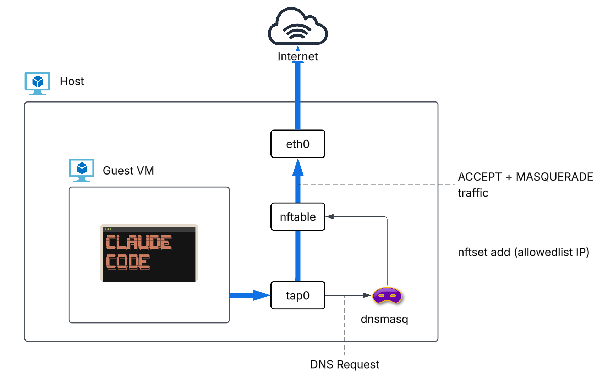

# Claude Code Sandbox

Runs Claude Code inside a cloud-hypervisor microVM. The VM's outbound traffic is filtered to a list of allowed hostnames, so the agent can reach the Anthropic API, GitHub, and whatever package registries you need, but not arbitrary hosts.

## Why

Claude Code ships a built-in [`/sandbox`](https://code.claude.com/docs/en/sandboxing) command, but on Linux it doesn't really work. One known bug: switching models with [`/model`](https://code.claude.com/docs/en/commands) can silently wipe your entire network allowlist, leaving Claude with unrestricted internet access ([anthropics/claude-code#44791](https://github.com/anthropics/claude-code/issues/44791)). And even when it does work, it's seccomp-based: the sandbox and the host share a kernel, so any kernel bug in an allowed syscall is a way out. `io_uring` alone has produced [multiple container escapes](https://nvd.nist.gov/vuln/detail/CVE-2022-29582) in recent years.

There's also [`--dangerously-skip-permissions`](https://docs.anthropic.com/en/docs/claude-code/cli-reference). You need it if you want Claude to actually do things without asking before every shell command and file write. Without it, alert fatigue kicks in and you end up approving everything anyway. But with it, Claude has pretty much free rein over your machine. The newer [auto mode](https://code.claude.com/docs/en/permission-modes) uses a classifier to decide what needs approval, but [independent testing](https://arxiv.org/abs/2604.04978) found an 81% false negative rate on adversarial scenarios, and 36% of state-changing file writes bypass the classifier entirely.

This project gives Claude a disposable VM to work in and restricts what it can reach on the network. If Claude wrecks the VM, rebuild it. If something tries to exfiltrate data, it hits a hostname allowlist. Neither protection is perfect, but together they make `--dangerously-skip-permissions` a lot less scary.

## How it works

Claude Code runs inside a Debian 13 guest VM on [cloud-hypervisor](https://github.com/cloud-hypervisor/cloud-hypervisor). All outbound traffic goes through an [nftables](https://nftables.org) filter on the host before it reaches the internet.

The filtering works at the DNS layer. [dnsmasq](https://thekelleys.org.uk/dnsmasq/doc.html) handles DNS for the VM and uses its [`nftset`](https://thekelleys.org.uk/dnsmasq/docs/dnsmasq-man.html) feature to populate a live IP set whenever it resolves an allowed hostname. nftables checks that set before forwarding packets. If the destination IP isn't in it, the connection is rejected right away, not left to time out.



## Details

- **Guest OS**: Debian 13 (Trixie), built with [virt-builder](https://libguestfs.org)
- **Hypervisor**: [cloud-hypervisor](https://github.com/cloud-hypervisor/cloud-hypervisor) with seccomp enabled
- **Filesystem sharing**: [virtiofs](https://virtio-fs.gitlab.io) via [virtiofsd](https://gitlab.com/virtio-fs/virtiofsd) — `~/work` read-write at `/workspace`, `~/.claude` read-only at `/etc/claude`
- **Guest user**: created with your host UID/GID so file ownership is consistent across mounts
- **DNS**: dnsmasq on the host (`172.16.0.1`), upstream to `8.8.8.8`
- **Network**: TAP device `claude-tap0`, guest IP `172.16.0.2`, host IP `172.16.0.1`
- **VM resources**: 4 CPUs, 8GB RAM (configurable in `config/config.sh`)

## Prerequisites

Linux with KVM (`/dev/kvm` must be accessible).

```bash
# cloud-hypervisor
wget https://github.com/cloud-hypervisor/cloud-hypervisor/releases/latest/download/cloud-hypervisor-static \
    -O /usr/local/bin/cloud-hypervisor
chmod +x /usr/local/bin/cloud-hypervisor
sudo setcap cap_net_admin+ep /usr/local/bin/cloud-hypervisor

# virtiofsd (Fedora installs it to /usr/libexec, so symlink it)
sudo dnf install virtiofsd
sudo ln -s /usr/libexec/virtiofsd /usr/local/bin/virtiofsd

# Other dependencies
sudo dnf install dnsmasq nftables libguestfs-tools-c
```

## Setup

### 1. Configure the allowlist

```bash
cp config/allowlist.txt.example config/allowlist.txt
```

Edit `config/allowlist.txt` — one hostname per line, `#` comments supported. The example covers the Anthropic API, GitHub, and common package registries.

### 2. Configure packages (optional)

```bash
cp config/packages.txt.example config/packages.txt
```

`packages.txt` has three sections (`[apt]`, `[npm]`, `[pip]`) for what gets installed in the guest image. The default includes the Claude Code npm package.

### 3. Build the guest rootfs

```bash
./build-rootfs.sh
```

Builds a 20GB Debian 13 image using `virt-builder`, then extracts the kernel and initramfs into `build/`. Run this as your regular user, not root. If you change `packages.txt` or the virtiofs mounts, rebuild.

## Usage

```bash
# Start the sandbox
sudo ./claude-sandbox.sh start

# SSH in as your user
./claude-sandbox.sh ssh

# Check what's running
./claude-sandbox.sh status

# Stop everything
sudo ./claude-sandbox.sh stop
```

## Customizing mounts

The default mounts are defined in `config/config.sh`. To add more without editing that file, create `config/config.local.sh`:

```bash
cp config/config.local.sh.example config/config.local.sh
```

Then append to `VIRTIOFS_MOUNTS`:

```bash
VIRTIOFS_MOUNTS+=(
    "my-data:$REAL_HOME/some/path:/guest/path:ro"
)
```

Rebuild the rootfs after changing mounts — the guest fstab is generated at build time.